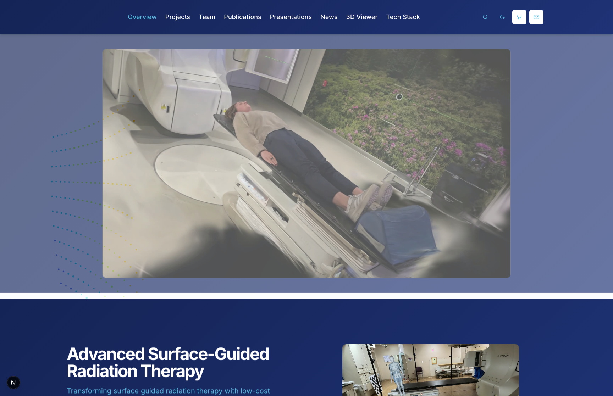

# Thomas Lab Website

Official lab website source for **thomas-lab.com**.



## Overview

This repository contains the Thomas Jefferson University Thomas Lab website focused on AI + computer vision methods for radiation oncology, including:

- Research project summaries
- Team profiles and bios
- Publications and presentations
- Lab news and awards
- Interactive media (video and point-cloud content)

## Tech Stack

- Next.js 15 (App Router)
- React 19
- TypeScript
- Tailwind CSS
- Radix UI components

## Key Routes

- `/` Home
- `/projects` Projects
- `/team` Team
- `/publications` Publications
- `/presentations` Presentations
- `/news` News
- `/3d-viewer` 3D viewer

## Local Development

1. Install dependencies:

```bash
pnpm install
```

2. Start the dev server:

```bash
pnpm dev
```

3. Open:

```text
http://localhost:3000
```

## Deployment

This repository is intended to be the source of truth for production deployment to **thomas-lab.com** via Vercel.

## Notes

- Homepage screenshot stored at `docs/homepage-screenshot.png`.
- Last updated: March 10, 2026.
